#+TITLE: Singapore Sign Language (SgSL) Sign Bank
#+AUTHOR: Hankertrix
#+STARTUP: showeverything
#+OPTIONS: toc:2
#+HTML_HEAD: 

* Concepts, Definitions and Tips

** Agent gesture
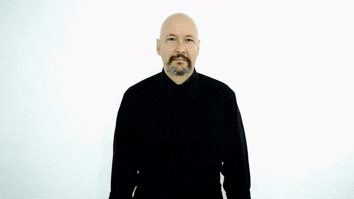

The agent gesture is to show a box with both hands and move the box down.
This gesture used to turn change an action, into a person doing the action. For example, teach + agent gesture = teacher.

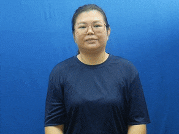

** "Wh" facial expression
This expression is usually used when asking a question, and can be shown as "furrowing" the eyebrows a bit, with the head tilted slightly backwards, and the body leaning towards the respondent.

** Signing area
The signing area refers to the area from the top of your head to the bottom of your waist. The width of that area is shoulder width.

** Tense markers
- Time in sign language is not indicated through tenses, and the verbs in sign language do not change in form when tenses change.
- For example the sign for "eat" and "ate" are the same.
- Time is therefore indicated through the use of adverbs of time.

** Intensity of signs
Intensity is shown by varying the intensity or speed with which a sign is made or by incorporating facial expression. For example:
1. Walk can be made quickly or slowly to indicate how the person is walking.
2. Drink can be modified depending on the volume consumed.
3. Smart becomes brilliant when the sign is exaggerated.
4. Pretty becomes beautiful when the sign is exaggerated.

** Initialised sign
An initialised sign is a sign that uses a letter of the English alphabet in its gesture, usually the first letter of the word.

** Letter drag
You can drag out letters at the end of a finger spell if the ending letters are the same. The motion is like pulling the letter out to the side.

** Plural words
Just repeat the sign once more to show that it is plural.

** Nouns from verbs
Usually, the noun form of a word is just the verb form done twice.

* Signs

** Alphabet

*** American sign language
[[./images-of-signs/american-sign-language-alphabet.jpg]]

*** Singapore sign language
[[./images-of-signs/singapore-sign-language-alphabet.png]]

The hand sign for T is slightly different in Singapore Sign language, with the thumb touching the underside of the index finger instead of the thumb being in between the index and middle finger.

** Numbers

*** Number
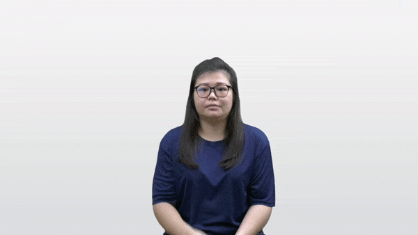

*** 1 to 10
[[./images-of-signs/sign-language-numbers-1-10.png]]

*** 11
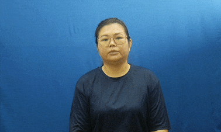

*** 12
[[./images-of-signs/number-twelve.gif]]

*** 13
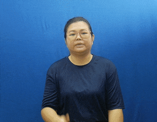

*** 14
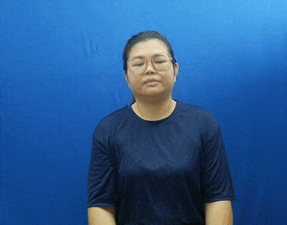

*** 15
[[./images-of-signs/number-fifteen.gif]]

*** 16
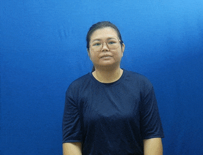

*** 17
[[./images-of-signs/number-seventeen.gif]]

*** 18
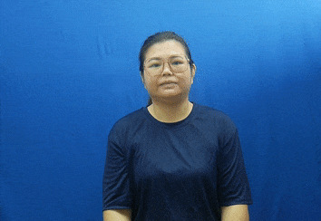

*** 19
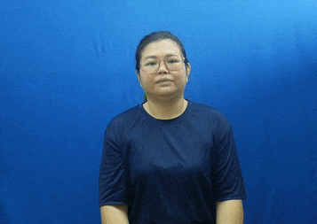

*** 20
[[./images-of-signs/number-twenty.gif]]

*** 21
[[./images-of-signs/number-twenty-one.gif]]

*** 22 to 99
Similar to the number "21", just show the first number followed by the second number.

*** 100 (hundred)
[[./images-of-signs/hundred.gif]]

*** 1,000 (thousand)

*** 1,000,000 (million)
[[./images-of-signs/million.gif]]

*** 1,000,000,000 (billion)
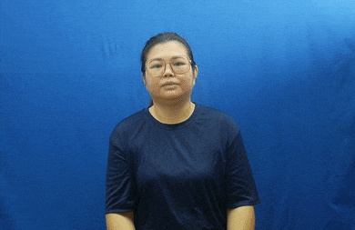

*** 1,000,000,000,000 (trillion)
Same motion as the billion hand sign, but with a "T" hand sign instead of a "B" hand sign.

** Days of the week

*** Monday
[[./images-of-signs/monday.gif]]

*** Tuesday
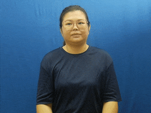

*** Wednesday
[[./images-of-signs/wednesday.gif]]

*** Thursday
[[./images-of-signs/thursday.gif]]

*** Friday
[[./images-of-signs/friday.gif]]

*** Saturday
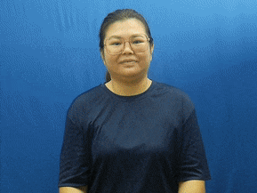

*** Sunday
[[./images-of-signs/sunday.gif]]

** Months of the year

*** January
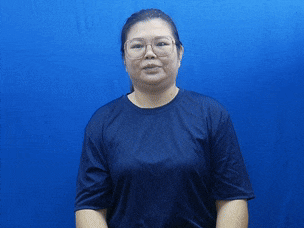

Jump a "J" hand sign over the open palm facing inwards with fingers pointing upwards.

*** February
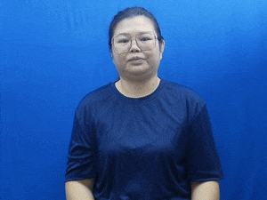

*** March
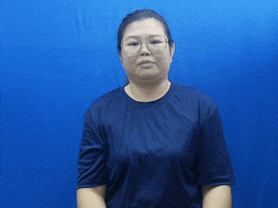

*** April
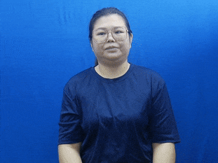

*** May
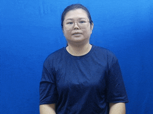

Jump an "M" hand sign over the open palm facing inwards with fingers pointing upwards, then transition to a "Y" hand sign.

*** June
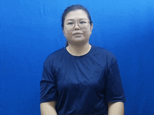

Jump a "J" hand sign over the open palm facing inwards with fingers pointing upwards, then transition to an "E" hand sign.

*** July
[[./images-of-signs/july.gif]]

Jump a "J" hand sign over the open palm facing inwards with fingers pointing upwards, then transition to an "Y" hand sign.

*** August
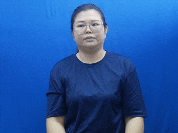

Jump an "A" hand sign over the open palm facing inwards with fingers pointing upwards, then transition to an "G" hand sign.

*** September
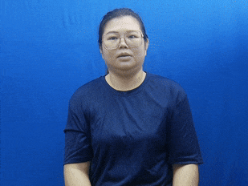

*** October
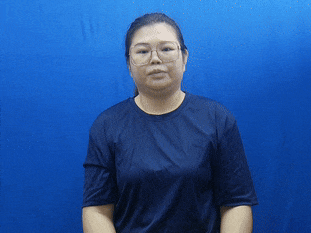

*** November
[[./images-of-signs/november.gif]]

Jump an "N" hand sign over the open palm facing inwards with fingers pointing upwards.

*** December
[[./images-of-signs/december.gif]]

** Mathematical symbols

*** Add (plus)

**** Variation 1
[[./images-of-signs/add-math-variation-a.gif]]

**** Variation 2
Make the "C" hand sign with one hand, but rotate it such that the palm is facing towards your body. Bring the other palm, which is also facing towards your body, into the hand that is doing the "C" hand sign.

*** Subtract (minus)

**** Variation 1
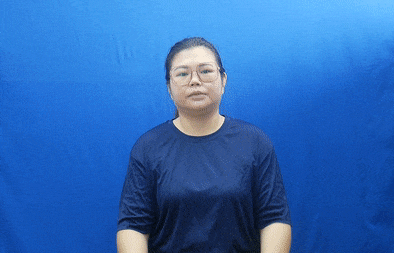

**** Variation 2
Literally just show the minus symbol, which is just a line, with the index finger.

*** Multiply (times)
[[./images-of-signs/multiply-math.gif]]

*** Divide
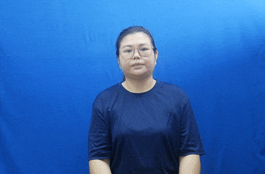

*** Equal
[[./images-of-signs/equal-math.gif]]

*** Percent (percentage)
[[./images-of-signs/percent-math.gif]]

*** To the power of
The example below shows 2^4, or 2 to the power of 4.

[[./images-of-signs/to-the-power-of-math.gif]]

*** Decimal point

**** Variation 1
Just point your index finger on one hand straight in front to show a dot.

**** Variation 2
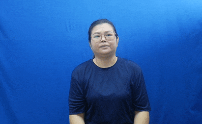

** Vocabulary

*** I
Point to your chest.

*** Me
Same as "I".

*** My
[[./images-of-signs/my.gif]]

*** Mine
Same motion as "my", but do it twice.

*** Self
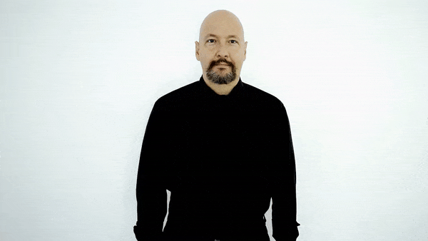

*** You
Point to the other person.

*** Your
[[./images-of-signs/your.gif]]

*** Yours
Same motion as "your", but do it twice.

*** Let's
Make the "L" hand sign with both hands, palm facing each other and index finger pointing in front. Put your hands beside your waist and move them in front.

*** We

**** Variation 1
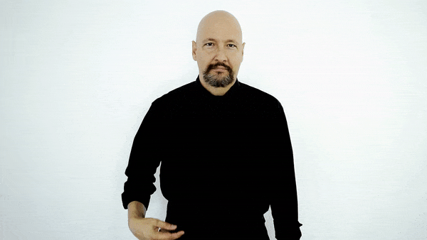

This variation is used to refer to a group of people.

**** Variation 2
Make the "P" hand sign, but rotate it such that the palm is facing upwards, then move it inwards and outwards repeatedly.

This variation is used to refer to two people, like you and your friend.

*** Faculty
Same motion as the first variation of "we", but form the "F" hand sign instead.

*** Our
[[./images-of-signs/our.gif]]

*** They / Them
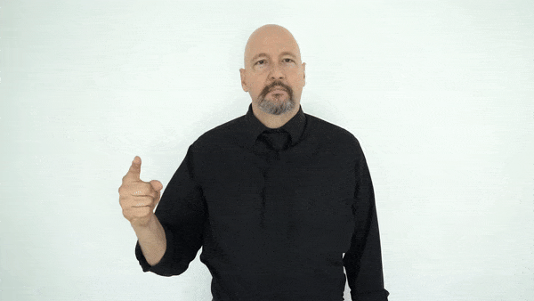

**** Referring to 2 other people
[[./images-of-signs/they-two-people.gif]]

**** Referring to 3 other people
[[./images-of-signs/they-three-people.gif]]

**** Referring to 4 other people
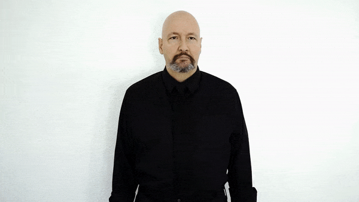

*** Their
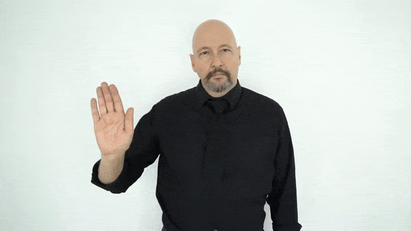

*** He
[[./images-of-signs/he.gif]]

*** She
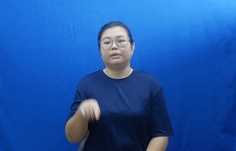

*** Oh
Move the "Y" hand sign front and back.

*** Ooh / Oooo
Make the "O" hand sign with both hands and shake them side to side.

*** Yes
[[./images-of-signs/yes.gif]]

The "yes" gesture must include the head nod together with the hand gesture.

*** Yeah
Make the "Y" hand sign with both hands with palm facing down, then shake them side to side.

*** No
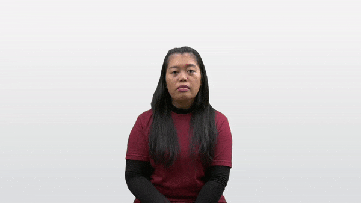

The "no" gesture must include the head shake together with the hand gesture.

*** Introduce
[[./images-of-signs/introduce.gif]]

*** Goodbye / Bye
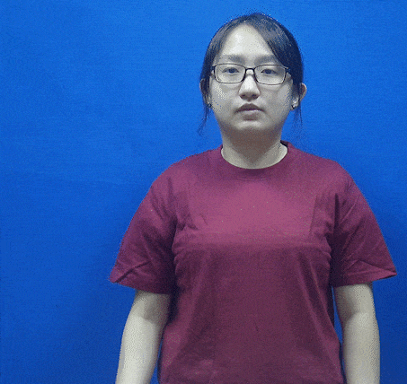

Wave goodbye.

*** During
[[./images-of-signs/during.gif]]

*** While
Do the "W" hand sign with both hands, and with palms facing each other. Place them at the side of your body, with one hand in front of the other, and then move them outwards.

*** Who
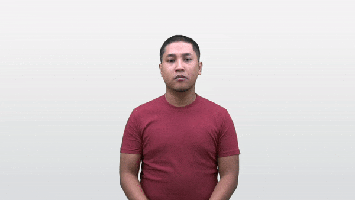

*** What

**** Variation 1
[[./images-of-signs/what-variation-a.gif]]

This variation is usually used at the start of a sentence, like the formal "What is your name?".

**** Variation 2

This variation is usually used at the end of a sentence, like the casual "Your name what?".

*** When
[[./images-of-signs/when.gif]]

*** Where
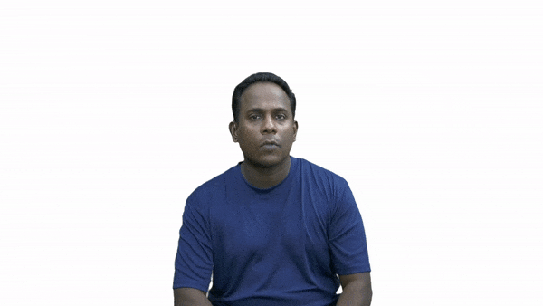

Where is usually used at the end of a sentence, so "Where do you live?" becomes "You live where?".

*** Why
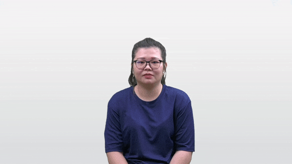

*** Which
[[./images-of-signs/which.gif]]

*** How
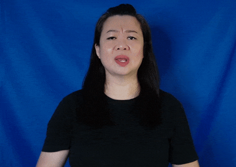

*** This / That
[[./images-of-signs/this.gif]]

*** I love you / ILY
[[./images-of-signs/i-love-you.gif]]

*** Teochew

**** Variation 1
Make the "I love you" hand sign and put your index finger at your temple. Open and close the middle and ring finger quickly.

**** Variation 2
Start with both palm facing upwards, and with one hand in front of the other, facing to the side. Then make a circle by pulling the palms upwards and then back down again, while transitioning the open palm to the "8" hand sign with the palm facing downwards at the end of the gesture.

*** Plane / Aeroplane / Aerospace / Airplane
Fly the "I love you" hand sign over your head.

*** Airport
Use the "plane" hand sign, and show it either flying off from your hand if you're departing from an airport, or landing on your hand if you're arriving at an airport.

*** Fly

**** Variation 1
Same motion as "plane", but move your hand back down to your chest height, drawing a semicircle over your head with your hand.

**** Variation 2
Flap your hands like you're flapping your wings.

*** If

**** Variation 1
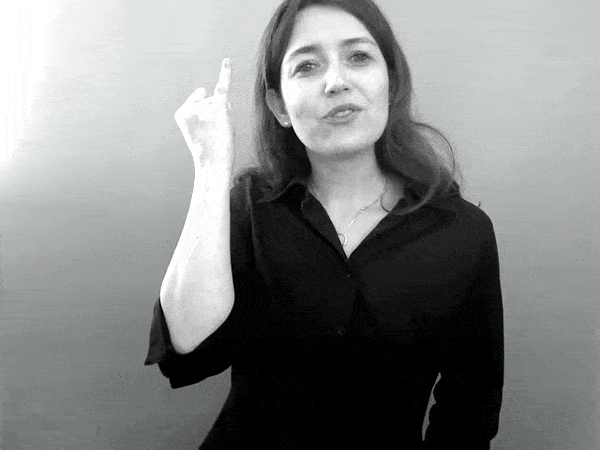

Make the "I" hand sign and touch the pinky beside your eye twice. Your palm should be facing backwards.

**** Variation 2
[[./images-of-signs/if-variation-b.gif]]

Just finger spell "if".

*** Suppose
Same as the first variation of "if", but put your pinky beside your temple instead of beside your eye.

*** Bad

**** Variation 1
[[./images-of-signs/bad-variation-a.gif]]

**** Variation 2
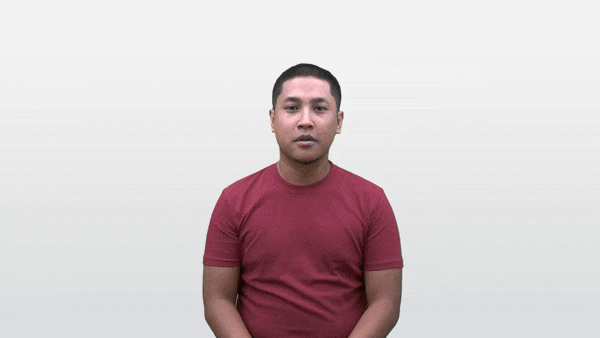

**** Variation 3
Similar motion to the first variation of the "if" hand sign, but put the hand in front of your body instead of beside your eye.

*** Evil
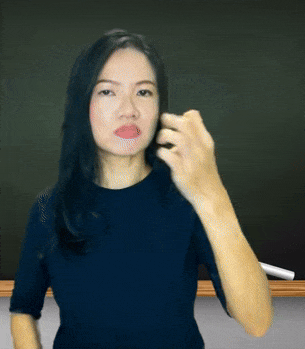

*** Good

**** Variation 1
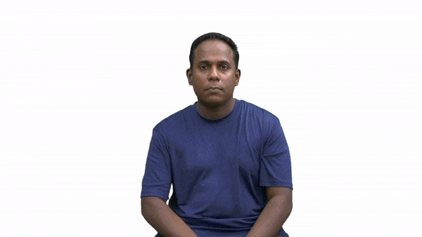

**** Variation 2
Show the thumbs up sign.

*** Perfect

**** Variation 1

**** Variation 2
[[./images-of-signs/perfect-variation-b.gif]]

**** Variation 3
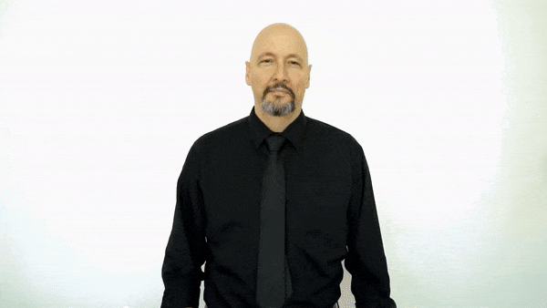

**** Variation 4
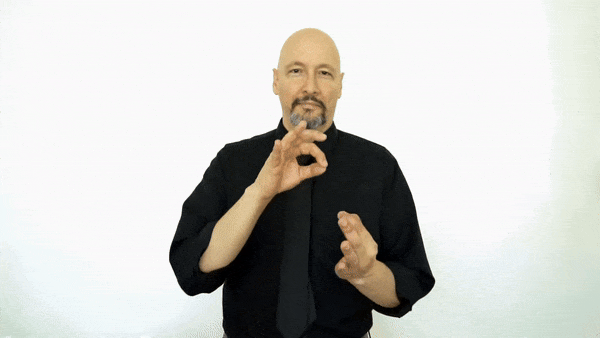

*** Nice / Clean (depends on context)
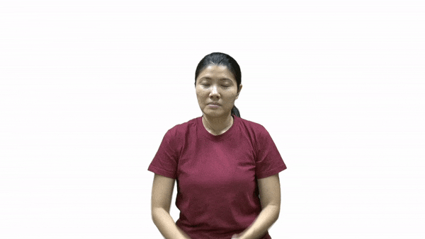

*** Smile

**** Variation 1
[[./images-of-signs/smile-variation-a.gif]]

**** Variation 2
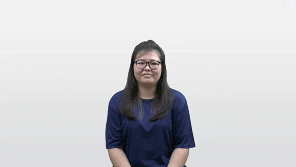

*** Excuse me
Same motion as "nice / clean", but do it twice.

*** Please
[[./images-of-signs/please.gif]]

*** Sorry
Same motion as "please", but with the "S" hand sign, or a closed fist.

*** Thank you
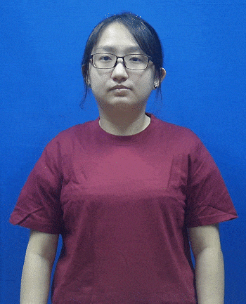

*** Hold

**** Variation 1
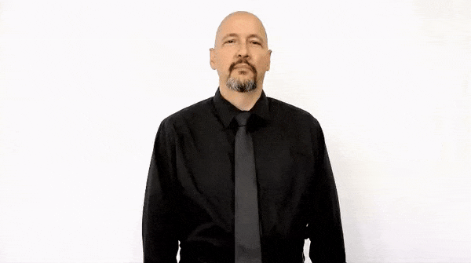

This variation is for bigger objects, or a person.

**** Variation 2
Have one hand with the index finger pointing upwards, with the palm facing the side. Then, hold the index finger with all the fingers on the other hand. This variation is for poles or rod-like objects.

*** Grab
Pretend to grab a stick.

*** Take
Pretend to grab a tissue from a tissue box with all fingers.

*** Get
[[./images-of-signs/get.gif]]

*** Pick
[[./images-of-signs/pick.gif]]

*** Catch
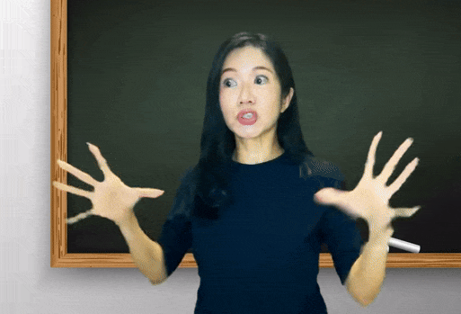

*** Throw
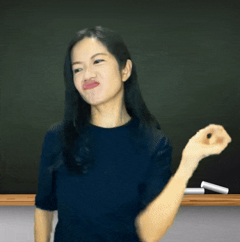

*** Find
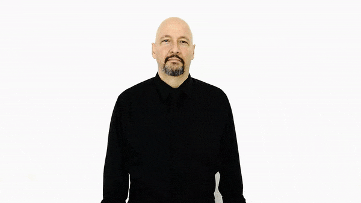

*** Search
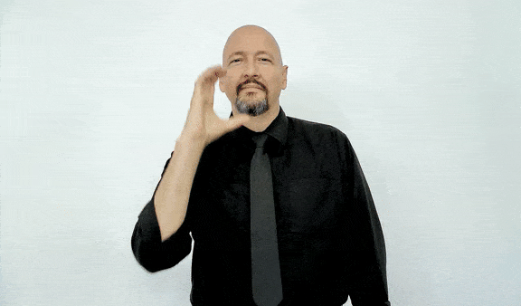

*** Search engine

*** Choose

**** Variation 1
[[./images-of-signs/choose-variation-a.gif]]

**** Variation 2
[[./images-of-signs/choose-variation-b.gif]]

*** Put
Pretend to hold on to something flat like a file and put it into a box.

*** Care
Do the "V" hand sign with both hands, stack them one on top of the other and then draw a horizontal circle.

*** Take care

**** Variation 1

Just finger spell "TC".

**** Variation 2
Do the gesture for "take", then followed by "care".

*** So

*** Also
With the palm always facing down, do the "A" hand sign, then do the "L" hand sign. Then, do the gesture for "so".

*** Because

*** Therefore / Hence / Thus

This is the mathematical symbol for "therefore".

*** Additional / Extra / Bonus
[[./images-of-signs/additional.gif]]

*** So what / So? / Well...
[[./images-of-signs/so-what.gif]]

Change your facial expression based on what you mean with this gesture.

*** And

*** Then

**** Variation 1
[[./images-of-signs/then-variation-a.gif]]

**** Variation 2
[[./images-of-signs/then-variation-b.gif]]

*** Or
Same motion as the second variation of "then", but use the "O" hand shape instead of the index finger.

*** Not
[[./images-of-signs/not.gif]]

*** Can / Able

**** Variation 1
[[./images-of-signs/can-variation-a-diagram.gif]]

**** Variation 2

**** Variation 3

*** Cannot (Can't)

**** Variation 1

Shake your head when doing this gesture.

**** Variation 2

Shake your head when doing this gesture.

*** Will

*** Do
[[./images-of-signs/do.gif]]

*** Behave / Behaviour

*** Do not (Don't)
[[./images-of-signs/do-not.gif]]

*** Correct / Right / Accurate

*** Correction
Same motion as "correct", but do it twice.

*** Wrong

*** Mistake

*** Favourite
[[./images-of-signs/favourite.gif]]

*** Luck / Lucky

*** Like

**** Variation 1

**** Variation 2

*** Dislike
[[./images-of-signs/dislike.gif]]

*** Enjoy

*** Thing / Device

*** Nothing

**** Variation 1
[[./images-of-signs/nothing.gif]]

**** Variation 2
Similar to the first variation, but for the first part of the gesture, show a "0" hand sign instead of the flattened "O" hand sign below the chin. The second part of the gesture is the same.

*** Every

*** Everything
Just do the gesture for "every" then followed by "thing".

*** Want
[[./images-of-signs/want.gif]]

*** Don't want

**** Variation 1
Do the gesture for "don't" followed by "want".

**** Variation 2
Make the "L" hand sign with one hand and move it up and down in front of your mouth.

*** Have / Has

[[./images-of-signs/have.gif]]

*** Give
[[./images-of-signs/give.gif]]

*** Treat
Make the "T" hand sign with both hands and make sure the thumb is pointing forward. Then move both hands forward.

*** Share

*** Bring

*** Feel
[[./images-of-signs/feel.gif]]

*** Sad

*** Disappointed

*** Frustrated

*** Happy
[[./images-of-signs/happy.gif]]

*** Funny
[[./images-of-signs/funny.gif]]

*** Fun
Same motion as "funny", but do it once instead of twice.

*** Curious
[[./images-of-signs/curious.gif]]

*** Interest
[[./images-of-signs/interest.gif]]

*** Interesting / Interest
[[./images-of-signs/interesting.gif]]

*** Honest

*** Trust
[[./images-of-signs/trust.gif]]

*** Confident
[[./images-of-signs/confident.gif]]

*** Proud
[[./images-of-signs/proud.gif]]

*** Snobbish
[[./images-of-signs/snobbish.gif]]

*** Angry
[[./images-of-signs/angry.gif]]

*** Tired
[[./images-of-signs/tired.gif]]

*** Blur
Make an open palm with all fingers outstretched, and your palm facing your face. Move your palm side to side in front of your face.

*** Bored
[[./images-of-signs/bored.gif]]

*** Pain

*** Guilty

*** Embarrassed
[[./images-of-signs/embarrassed.gif]]

*** Shy
[[./images-of-signs/shy.gif]]

*** Bashful
Same motion as "shy", but do it with both hands instead of just one.

*** Stress
Put both hands beside your head, palm facing your face, and open and close your fingers.

*** Quiet
[[./images-of-signs/quiet.gif]]

*** Calm
Same motion as "quiet", but use the "C" hand sign instead of the open palm.

*** Increase

*** Decrease
[[./images-of-signs/decrease.gif]]

*** More
Make two "O" hand signs with both hands and bring them together.

*** Most
[[./images-of-signs/most.gif]]

*** Too
Same motion as "more", but do the "1" hand sign for one of the hands, and touch the tip of the index finger to the side of the "O" hand sign on the other hand.

*** Less
[[./images-of-signs/less.gif]]

*** Least
Do the gesture for "less", then do the gesture for "most". Least is essentially "less-most".

*** Limited

*** Head

*** Face
[[./images-of-signs/face.gif]]

*** Lip

*** Body
[[./images-of-signs/body.gif]]

*** Hand

**** Variation 1

**** Variation 2

*** Heart

**** Variation 1

**** Variation 2
Draw a heart shape with both index fingers at your heart.

**** Variation 3
Show a heart shape with both hands at your heart.

*** Blood / Bloody

*** All

**** Variation 1
[[./images-of-signs/all-variation-a.gif]]

**** Variation 2
[[./images-of-signs/all-variation-b.gif]]

*** Some
[[./images-of-signs/some.gif]]

*** Someone
Do the gesture for "some", then do the gesture for "one".

*** Somebody
Do the gesture for "some", then do the gesture for "body".

*** No one
Do the gesture for "no", then do the gesture for "one".

*** Nobody
Do the gesture for "no", then do the gesture for "body"

*** Few

*** Only

*** French
Same motion as "only", but use the "F" hand sign instead.

*** Both

*** Another / Other

*** Time

*** Now

*** Recent / Recently
[[./images-of-signs/recent.gif]]

*** Usually

This gesture is the gesture for "most", followed by the gesture for "time".

*** Morning
[[./images-of-signs/morning.gif]]

*** Afternoon
[[./images-of-signs/afternoon.gif]]

The hand is pointed diagonally in front.

*** Noon
Similar to "afternoon", but the palm faces the side and the arm is vertical instead of diagonally front and upwards.

*** Evening
Similar to "afternoon", but lower the hand such that it is pointed straight in front, instead of diagonally front and upwards.

*** Night

*** Midnight

*** Over (as in over something)
Have two palms facing down, with one palm on top of another, but not touching the other palm. Move the palm that is on top in a circle over the other palm.

*** Under
Put one hand horizontally in front of you with the palm facing down. Then, make the thumbs up hand sign and move it under the palm of the other hand.

*** On

Just put one hand on top of the other hand.

*** Flat (noun)
Do the gesture for "on", then bring your hand upwards while changing from an open palm to the "F" hand sign.

*** Off
[[./images-of-signs/off.gif]]

When one hand is already on top of the other hand, remove the hand on top.

*** In

*** Include

*** Inclusive
[[./images-of-signs/inclusive.gif]]

*** Out
[[./images-of-signs/out-diagram.gif]]

*** With
[[./images-of-signs/with.gif]]

*** Without

Shake your head when you do the sign.

*** Within
Do the "with" hand sign then do the "in" hand sign.

*** Of
Make two "F" hand signs with both hands, then close the circular part of the hand sign around the other hand's hand sign, interlocking the two hands at the circular part of the hand sign. One hand should have its last three fingers pointing forward, and the other hand should have the last three fingers pointing upwards.

*** At
Same motion as the hand sign for "thousand", but instead of the open palm facing the other hand, point the open palm forward and the fingers on the other hand should contact the back of the palm instead.

*** Same / Similar / Alike / Like

**** Variation 1
[[./images-of-signs/same-variation-a.gif]]

**** Variation 2

*** But
[[./images-of-signs/but.gif]]

*** Different
Same motion as "but", but do it twice.

*** Just

*** Example
[[./images-of-signs/example.gif]]

*** Evaluate
[[./images-of-signs/evaluate.gif]]

*** About

*** Is
Put the thumb of the "I" hand sign on your chin.

*** Are
Put the tips of the fingers of the "R" hand sign on your chin.

*** Be
Put the tips of the fingers of the "B" hand sign on your chin.

*** By

**** Variation 1
Place one hand vertically with all fingers pointing upwards, and with your palm facing the side. The other hand should be horizontal with the palm facing downwards and all fingers pointing to the side. Move this hand past the other hand, on the outside of your body.

**** Variation 2
Make a "B" hand sign and place it below your mouth, then move it outwards to form a "Y".

*** Beside
[[./images-of-signs/beside.gif]]

*** Behind

*** Between

*** Through

*** For
[[./images-of-signs/for.gif]]

*** From
[[./images-of-signs/from.gif]]

*** Away
[[./images-of-signs/away.gif]]

*** Always
[[./images-of-signs/always.gif]]

*** Much
[[./images-of-signs/much.gif]]

*** Many

**** Variation 1

**** Variation 2
[[./images-of-signs/many-variation-b.gif]]

*** Any
Make the "A" hand sign with one hand with the palm facing up. Then rotate your hand until the palm faces down, and change from the "A" hand sign to the "Y" hand sign while rotating.

*** Anything
Do the gesture for "any", then do the gesture for "thing".

*** Anytime
Do the gesture for "any", then do the gesture for "time".

*** Anywhere
Do the gesture for "any", then do the gesture for "where".

*** Anyone
Do the gesture for "any", then do the gesture for "one".

*** Ever
Same motion to "Monday", but instead of the "M" hand sign, do the "E" hand sign.

*** Never
[[./images-of-signs/never-diagram.gif]]

The motion of the gesture looks a bit like a question mark. Make sure to shake your head when doing this gesture.

*** Weather
Same motion as "never", but use the "W" hand sign instead of the open palm.

*** Season
Same motion as "never", but use the "S" hand sign instead of the open palm.

*** Very
[[./images-of-signs/very.gif]]

*** Really / Real / True / Truth

**** Variation 1

**** Variation 2

*** Quite

The only difference between this and "really" is the facial expression.

*** Don't bluff

*** Bluff
Same motion as "Don't bluff", but without the head shake.

*** Lie / Fib

*** Near

*** Far
[[./images-of-signs/far.gif]]

*** Wait
[[./images-of-signs/wait.gif]]

*** Service

**** Variation 1

**** Variation 2
Same hand motion as the first variation, but instead having your right in front of your chest, move your palms such that they are on one side of your body with the fingers pointed 45 degrees upwards and away from your body.

*** Patient

*** Slow
[[./images-of-signs/slow.gif]]

*** Fast
[[./images-of-signs/fast.gif]]

*** Quick / Quickly

*** Immediate / Immediately
[[./images-of-signs/immediate.gif]]

*** Turn
Hold up an index finger pointing upwards. To turn left, move a flat palm with the palm facing the index finger and turn left after the palm passes the finger. To turn right, move a flat palm with the back of the palm facing the index finger and turn right after the palm passes the finger.

*** Left (direction)

*** Right (direction)
[[./images-of-signs/right-direction.gif]]

*** Up (direction)
Make the "U" hand sign and move it upwards. Alternatively, you can just point upwards and move your hand upwards.

*** Down (direction)
Hold up a hand with the palm facing the body and move it downwards. Alternatively, you can just point downwards and move your hand downwards.

*** Top

*** Bottom
[[./images-of-signs/bottom.gif]]

*** To

*** Today

**** Variation 1
[[./images-of-signs/today-variation-a.gif]]

**** Variation 2
[[./images-of-signs/today-variation-b.gif]]

*** Tomorrow
[[./images-of-signs/tomorrow.gif]]

*** Yesterday

*** Daily

**** Variation 1
[[./images-of-signs/daily-variation-a.gif]]

**** Variation 2

*** Day

*** Week
[[./images-of-signs/week.gif]]

*** Month

*** World
[[./images-of-signs/world.gif]]

*** Year
Similar to "world", but with a closed fist instead of the "W" hand sign.

*** Types
Similar to "world", but with a "T" hand sign instead of the "W" hand sign.

*** Kind
Similar to "world", but with a "K" hand sign instead of the "W" hand sign.

*** Back

*** History
[[./images-of-signs/history.gif]]

*** Past

*** Future

*** First

**** Variation 1
[[./images-of-signs/first-variation-a.gif]]

**** Variation 2
Show the "1" hand sign and then quickly rotate your wrist around to face the palm inwards. It is similar to the "only" hand sign, but much faster and more forceful. This gesture can be extended to other numbers by doing their respective hand signs instead of the "1" hand sign. For example, the gesture for "third" would be the same motion, but showing the "3" hand sign instead of the "1" hand sign.

*** Last

**** Variation 1

This variation is used to refer to time, like last week, last month or last year.

**** Variation 2
[[./images-of-signs/last-variation-b.gif]]

This variation is used to refer to a numerical value, like the last bus, the last hour, the last time.

*** Later
[[./images-of-signs/later.gif]]

*** Not yet

*** Before
[[./images-of-signs/before.gif]]

*** After

*** Send
Similar motion to "after", but for the hand on the outside, the fingers should be pointing downwards instead of to the side.

*** Early

**** Variation 1

**** Variation 2

*** Late
[[./images-of-signs/late.gif]]

*** Since
[[./images-of-signs/since.gif]]

*** Start

*** Stop

*** Finish

*** End
Same motion as "finish", but use the "E" hand sign instead of the open palm.

*** Conclusion
Same motion as "finish", but use the "C" hand sign instead of the open palm.

*** Done / Over / Finish
Have two palms facing upwards with the fingers pointing forward. Then, rotate your hand such that the palms face downwards.

*** Already
Same motion as "done", but use the "A" hand sign with the thumbs pointing towards each other when the palms are facing upwards, and transition to an open palm when the palms are facing downwards.

*** Next
[[./images-of-signs/next.gif]]

*** Again
[[./images-of-signs/again.gif]]

*** Repeat
Same motion as "again", but use the "R" hand sign instead of the open palm.

*** Often
[[./images-of-signs/often.gif]]

*** Still

*** Ask

**** Variation 1
[[./images-of-signs/ask-variation-a.gif]]

**** Variation 2
[[./images-of-signs/ask-variation-b.gif]]

**** Variation 3
Similar to variation 2, but use only the index finger. The index finger becomes increasingly bent as it reaches its furthest point.

*** Pray
Exact same motion as the first variation of "ask".

*** Say / Hearing person
[[./images-of-signs/say.gif]]

*** Speak

**** Variation 1

**** Variation 2
[[./images-of-signs/speak-variation-b.gif]]

*** Voice

*** Gossip

*** Mention
[[./images-of-signs/mention.gif]]

*** Refer / Reference / Relay
[[./images-of-signs/refer.gif]]

*** Convince

*** Offend
Hold one arm at a 45-degree angle, with the elbow being lower than the hand. The palm of this hand should be facing down. The other hand forms the "O" hand sign and slides it down the outside of the arm.

*** Talk

*** Communication
Same motion as "talk", but with the "C" hand sign instead of the index finger.

*** Interview
Same motion as "talk", but with the "I" hand sign instead of the index finger.

*** Conversation
Same motion as "talk", but with 4 fingers instead of just the index finger.

*** Race (as in running race)
Same motion as "talk", but use the "R" hand sign instead and put your hands in front of your chest instead of in front of your mouth.

*** Traffic

*** Malay
Similar motion to "traffic", but have your hands beside your neck instead of in front of your chest. Your hands should also be angled, following the shape of your face.

*** Scream / Yell

**** Variation 1

**** Variation 2
[[./images-of-signs/scream-variation-b.gif]]

*** Call
Do the "C" hand sign and move it outwards from your mouth.

*** Contact
[[./images-of-signs/contact.gif]]

*** Text / Message

**** Variation 1
[[./images-of-signs/text-variation-a.gif]]

**** Variation 2

*** Phone / Telephone

*** Cell phone

**** Variation 1
[[./images-of-signs/cell-phone-variation-a.gif]]

**** Variation 2
[[./images-of-signs/cell-phone-variation-b.gif]]

*** Smartphone

*** Hope

**** Variation 1

**** Variation 2

**** Variation 3

**** Variation 4
Have both palms facing up, fingers pointed 45 degrees upwards, and on the side of your body. One palm should be closer to your body than the other. Then close all of your fingers on both palms, forming two fists. Bring your hands slightly closer to your body as you close your fingers on both palms.

*** Help
[[./images-of-signs/help.gif]]

Move your thumb towards the person you want to help, towards yourself if you want other people to help you.

*** Therapy
Same motion as "help", but use the "T" hand sign instead of the thumbs up hand sign.

*** Welfare
Same motion as "help", but use the "W" hand sign instead of the thumbs up hand sign.

*** Meet / Encounter
[[./images-of-signs/meet.gif]]

*** Meeting

*** Name
[[./images-of-signs/name.gif]]

*** Sit
[[./images-of-signs/name.gif]]

*** Show
[[./images-of-signs/show.gif]]

*** See

*** Recap
Same motion as "see", but move the "V" hand sign back after you move it outwards.

*** Look

**** Variation 1

**** Variation 2
Same motion as "see", but with the "L" hand sign and the palm facing outwards.

*** Notice / Recognise / Detect
[[./images-of-signs/notice.gif]]

*** Visual

*** Clear / Obvious

*** Promise / Swear / Pledge

**** Variation 1

**** Variation 2
[[./images-of-signs/promise-variation-b.gif]]

*** Must / Need / Have to / Require / Necessary / Compulsory

*** Shall / Should
Same motion as "must", but do it lightly and do it twice.

*** Might / Maybe / May
[[./images-of-signs/might.gif]]

*** Realise
[[./images-of-signs/realise.gif]]

*** Reason
[[./images-of-signs/reason.gif]]

*** Understand
[[./images-of-signs/understand.gif]]

*** Misunderstand
[[./images-of-signs/misunderstand.gif]]

*** Confused

*** Mean (verb)
[[./images-of-signs/mean-verb.gif]]

*** Forget
[[./images-of-signs/forget.gif]]

*** Remember
[[./images-of-signs/remember.gif]]

*** Dream

*** Smart
[[./images-of-signs/smart.gif]]

*** Brilliant
Same motion as "smart", but do it once more and move it away from your head when you do it again.

*** Think

*** Wonder
Make a "W" hand sign and rotate a circle around your temple.

*** Know

*** Don't know
Have your hand with all fingers pointing upwards and the palm facing the side. Bend your middle finger and put it on your temple. Then rotate your hand from front to back.

*** Guess

*** Learn

*** Practice
[[./images-of-signs/practice.gif]]

*** Train (verb) / Training
Same as "practice", but with the "T" hand sign instead of the fist.

*** Easy

*** Hard

*** Tough

*** Difficult
[[./images-of-signs/difficult.gif]]

*** Problem / Difficulty

*** Challenge

*** Book (noun)

*** Book (verb)

*** Read

*** Write

*** Draw
[[./images-of-signs/draw.gif]]

*** Work

*** Business
[[./images-of-signs/business.gif]]

*** Use
Same motion as "business", but use the "U" hand sign. The "U" hand sign can either have the palm facing outwards or inwards.

*** Function
Same motion as "business", but use the "F" hand sign. The thumb and index finger of the "F" hand sign should be the ones touching the back of the other palm.

*** Employ / Enterprise
Same motion as "business", but use the "E" hand sign.

*** Job

*** Hire / Recruit

*** Fire (verb)

*** Retire

*** Holiday
Similar motion to "retire", but don't cross the middle finger over the index finger, and do the motion twice.

*** Leisure
[[./images-of-signs/leisure.gif]]

*** Advertise

*** Break (verb)
Break as in to break something.

[[./images-of-signs/break.gif]]

*** Break (noun) / Intermission
Break as in to take a break.

[[./images-of-signs/intermission.gif]]

*** Go / Went

*** Gone / Missing / Absent / Passed Away / Dead / Extinct

*** Come
[[./images-of-signs/come.gif]]

*** Disappear
[[./images-of-signs/disappear.gif]]

*** Leave / Left

*** Full stop (symbol) / Period (symbol)

*** Buy
[[./images-of-signs/buy.gif]]

*** Shop
Same motion as "buy", but with "S" hand shape on the hand that is moving out of the palm on the other hand.

*** Pay
Make an open palm with one hand and face it upwards. Form a "P" hand sign with the other hand and flick the middle finger outwards.

*** Cost
[[./images-of-signs/cost.gif]]

*** No money

**** Variation 1

**** Variation 2

*** Money

**** Variation 1

**** Variation 2

*** Finance / Financial
Same motion as the first variation of "money", but use the "F" hand sign for the hand on top.

*** Dollar

*** Cent

*** Worth

*** Important
Similar motion to "worth", but surround a sphere from bottom to top, starting with the palm up and transitioning into the palms being down.

*** Value
Same motion as "important", but use the "V" hand sign instead.

*** Sell
[[./images-of-signs/sell.gif]]

*** Ready
Make two "R" hand signs using both hands with the palm facing outwards, then move both hands to one side.

*** Hate
[[./images-of-signs/hate.gif]]

*** Love

*** Interpret

*** Linguistics
Same motion as "interpret", but pull your hands apart.

*** Change
[[./images-of-signs/change.gif]]

*** Revision
Same motion as "change", but use the "R" hand sign for both hands instead of the "X" hand sign.

*** Translate
Same motion as "change", but use the "T" hand sign for both hands instead of the "X" hand sign. Then, the two "T" hand signs transition to index fingers pointing to the side.

*** Influence (verb) / Counsel (verb) / Advise

*** Influence (noun) / Counsel (noun) / Advice
Same motion as "influence (verb)", but do it twice.

*** Effective / Efficient
Same motion as "influence (verb)", but hold the "E" hand sign all the way instead of opening up a flattened "O" hand sign.

*** Distort / Mangle
[[./images-of-signs/distort.gif]]

*** Win
Pretend to hold the flag in one hand, then use the other hand to grab it.

*** Miss
Similar motion to "win", but instead of the hand pretending to hold a flag, point an index finger upwards. The other hand tries to grab the index finger but misses.

*** Succeed / Success

**** Variation 1

**** Variation 2

*** Fail

*** Lose (as in loser)
Hold an open palm facing up, and touch the fingers on the "V" hand sign to that open palm.

*** Lose (as in lose something) / Lost

**** Variation 1

**** Variation 2

*** Brave
[[./images-of-signs/brave.gif]]

*** Strong
Trace out a large bicep using your open palm, starting the thumb touching the top of the bicep and ending with the pinky finger touching the bottom of the bicep.

*** Power
Same motion as "strong", but use the "P" hand sign. The palm should always be facing inwards instead of changing from outwards to inwards.

*** Intense
Same motion as "strong", but use the "I" hand sign. The palm should always be facing inwards instead of changing from outwards to inwards.

*** Summarise
[[./images-of-signs/summarise.gif]]

*** Make

*** Manufacture
Same motion as "make", but form the "M" hand sign instead of a fist.

*** Build / Building

*** Block / Barrier
[[./images-of-signs/block.gif]]

*** Flat (as in HDB flat)
Make two "F" hand signs with both hands, both palms facing down. Place one hand on the back of the other hand and move that hand upwards.

*** Obstacle
[[./images-of-signs/barrier.gif]]

*** Tree

*** Park

*** Hill

*** Mountain
[[./images-of-signs/mountain.gif]]

*** Better
[[./images-of-signs/better.gif]]

*** Best
[[./images-of-signs/best.gif]]

*** Improve
[[./images-of-signs/improve.gif]]

*** Calendar
[[./images-of-signs/calendar.gif]]

*** Program
Similar motion to "calendar", but jump a "P" hand sign instead of a "C" hand sign.

*** Project
Similar to "program", but instead of continuing with the "P" when the hand is at the back of the palm, do the "J" hand sign instead.

*** Sign language

*** Language

Make two "L" hand signs with the index finger pointing forward and palm facing downwards, with the thumbs touching each other, then wiggle them while moving outwards.

*** Level
Similar motion to "language", but don't wiggle your fingers, and the index and thumb of the "L" hand sign should remain horizontal throughout the motion.

*** Dress
Start with both open palms facing towards your body and move them all the way down your body.

*** Keep
Make two "K" signs with both hands and stack them on top of each other vertically.

*** Free
Make two "F" hand signs with both hands and close them to your chest, then open them up like you're flying away.

*** Study
[[./images-of-signs/study.gif]]

*** Teach

*** Person

*** Individual
Same motion as "person", but use the "i" hand sign instead of an open palm.

*** Client
[[./images-of-signs/client.gif]]

*** People

*** Law

*** Course
Same motion as "law", but use the "C" hand sign instead of the "L" hand sign.

*** Lesson

*** Assistant / Aid
[[./images-of-signs/assistant.gif]]

*** Boss

*** President

*** Government
[[./images-of-signs/government.gif]]

*** Doctor
[[./images-of-signs/doctor.gif]]

*** Nurse
Same motion as "doctor", but use the "N" hand sign instead of the "D" hand sign.

*** Medicine / Medical
[[./images-of-signs/medicine.gif]]

*** Emergency

*** COVID-19

**** Variation 1

**** Variation 2
Similar to the first variation, but start with the end position of the gesture. Then rotate the palm to towards the side the thumb is on.

*** Expert

*** Pro / Professional
[[./images-of-signs/professional.gif]]

*** Secretary

*** Count

*** Account
Same motion as "count", but do it twice.

*** Accountant
[[./images-of-signs/accountant.gif]]

*** Bank
[[./images-of-signs/bank.gif]]

*** Colour

*** White
[[./images-of-signs/white.gif]]

*** Black
[[./images-of-signs/black.gif]]

*** Grey

*** Yellow

*** Purple
Same motion as "yellow", but with a "P" hand sign.

*** Blue
Same motion as "yellow", but with a "B" hand sign.

*** Green
Same motion as "yellow", but with a "G" hand sign.

*** The
Same motion as "yellow", but with a "T" hand sign.

*** Orange
[[./images-of-signs/orange.gif]]

*** Red

*** Pink
Same motion as "red", but form a "P" first and use the middle finger to draw the line down from your chin.

*** Brown

*** Transgender

*** Gay (sexual orientation)

*** Boy

Male nouns are all done above the temple.

*** Girl

Female nouns are all done below the nose.

*** Brother

*** Sister

*** Siblings
Do the gesture for "brother" then do the gesture for "sister".

*** Close
Place a palm facing towards your body with fingers pointing to the side. Make the "C" hand sign with the other hand and use it to push the palm inwards, or further towards your body.

*** Friend

*** Buddy
Same motion as "friend", but forming the "B" hand sign with both hands instead.

*** Mate
Same motion as "friend", but using the "M" hand sign with the fingers open instead.

*** Neighbour
Same motion as "friend", but using the "N" hand sign with the fingers open instead.

*** Community
Same motion as "friend", but with a fully open palm.

*** Boyfriend
Do the gesture for "boy", then do the gesture for "friend".

*** Girlfriend
Do the gesture for "girl", then do the gesture for "friend".

*** Fine
[[./images-of-signs/fine.gif]]

*** Man
Do the gesture for "boy", then do the "fine" gesture at the same height.

*** Woman
Do the gesture for "girl", then do the "fine" gesture at the same height.

*** Lady
[[./images-of-signs/lady.gif]]

*** Divorce
[[./images-of-signs/divorce.gif]]

*** Marry / Marriage / Married
[[./images-of-signs/marry.gif]]

*** Husband
Do the gesture for "boy", then do the gesture for "marry".

*** Wife
Do the gesture for "girl", then do the gesture for "marry".

*** Father

*** Mother

*** Parents
Do the gesture for "father", then the gesture for "mother".

*** Grandfather
[[./images-of-signs/grandfather.gif]]

*** Grandmother
[[./images-of-signs/grandmother.gif]]

*** Uncle
[[./images-of-signs/uncle.gif]]

*** Aunt

*** Cousin (male)
[[./images-of-signs/cousin.gif]]

*** Cousin (female)
Same motion as "cousin (male)", but do it beside your cheeks instead of your temple.

*** Niece
[[./images-of-signs/niece.gif]]

*** Nephew

*** Baby

*** Son
Do the gesture for "boy", then do the gesture for "baby", but don't rock the baby.

*** Daughter
Do the gesture for "girl", then do the gesture for "baby", but don't rock the baby.

*** Child

*** Children

*** Born / Birth

**** Variation 1

**** Variation 2

*** Tall

*** Short (height)

*** Short (measurement)

*** Long
[[./images-of-signs/long.gif]]

*** Thin
[[./images-of-signs/thin.gif]]

*** Fat

*** Big

**** Variation 1

**** Variation 2
[[./images-of-signs/big-variation-b.gif]]

*** Small

*** Little
Make the "L" hand sign with both hands with palm facing each other, and the index finger pointing forward, then move them towards the centre until the fingers touch.

*** Bit

*** Young
Push your chest upwards and outwards with your hands (palm facing towards you) and make a happy face.

*** Old
Push your head forward and downwards and show a goatee with your hands.

*** Pretty
Make a "P" hand sign and circle your head.

*** Handsome
Same motion as "P", but use the "H" hand sign instead.

*** Cute

*** Sweet
[[./images-of-signs/sweet.gif]]

*** Beautiful

*** Ugly
Cross the index fingers on both hands, forming a cross, the pull both hands away into the "X" alphabet hand sign.

*** Light

*** Dark

*** Light (weight)
Start with an open palm facing outwards on both hands and use your middle fingers to lift a box up, ending with the palm pointing upwards.

*** Heavy
Pretend to hold a box from underneath the box, then show your hands and body being weighed down by the heavy box.

*** Kill
[[./images-of-signs/kill.gif]]

*** Die / Death

**** Variation 1
[[./images-of-signs/die-variation-a.gif]]

**** Variation 2

**** Variation 3
[[./images-of-signs/die-variation-c.gif]]

*** Live
[[./images-of-signs/live.gif]]

*** Address
Same motion as "live", but with the thumbs up gesture instead of the "L" hand sign.

*** Survive
Similar motion as "live", but use the "S" hand sign instead of the "L" hand sign, and the fists should touch the stomach area before touching the chest area instead of a straight upwards motion.

*** Deaf

*** Braille

*** Control

*** Lead (as in leader)
Use one hand to grab the other hand, which has an open palm facing your body, and then pull it along.

*** Follow

*** Breathe

*** Eat

**** Variation 1
[[./images-of-signs/eat-variation-a.gif]]

**** Variation 2

**** Variation 3
Pretend to use your index and middle fingers as a chopstick to eat.

**** Variation 4
Pretend to use your hands to eat.

*** Food / Eat
[[./images-of-signs/food.gif]]

*** Breakfast
[[./images-of-signs/breakfast.gif]]

*** Lunch

*** Dinner

*** Supper
[[./images-of-signs/supper.gif]]

*** Meal
Same motion as "supper", but with the "M" hand sign.

*** Full

**** Variation 1
[[./images-of-signs/full-variation-a.gif]]

The hand moves towards your body, not away from your body.

**** Variation 2
[[./images-of-signs/full-variation-b.gif]]

*** Enough
Similar motion to the first variation of "full", but the hand moves away from your body instead of towards your body.

*** Hungry

*** Passion
Same motion as "hungry", but do the motion over your chest.

*** Horny
Same motion as "passion", but do it continuously and with more intensity.

*** Cake
[[./images-of-signs/cake.gif]]

*** Pie

*** Fruit

*** Apple

**** Variation 1

**** Variation 2

*** Banana

*** Cherry
[[./images-of-signs/cherry.gif]]

*** Coconut

*** Durian

*** Grapes

**** Variation 1
[[./images-of-signs/grapes-variation-a.gif]]

**** Variation 2

*** Mango

**** Variation 1
[[./images-of-signs/mango-variation-a.gif]]

**** Variation 2
[[./images-of-signs/mango-variation-b.gif]]

*** Mangosteen

*** Lime
[[./images-of-signs/lime.gif]]

*** Juice
Same motion as the gesture for "lime", but with the "Y" hand sign instead of the "L" hand sign.

*** Orange juice
Do the gesture for "orange", then do the gesture for "juice".

*** Lemon / Lemonade

**** Variation 1

**** Variation 2
[[./images-of-signs/lemon-variation-b.gif]]

*** Papaya

*** Pineapple

**** Variation 1
[[./images-of-signs/pineapple-variation-a.gif]]

**** Variation 2

*** Berry
[[./images-of-signs/berry.gif]]

*** Blackberry (fruit)
Do the gesture for "black", then do the gesture for "berry".

*** Blueberry
Do the gesture for "blue", then do the gesture for "berry".

*** Raspberry
Do the hand sign for "R", then do the gesture for "berry".

*** Strawberry

**** Variation 1
[[./images-of-signs/strawberry-variation-a.gif]]

**** Variation 2
Do the hand sign for "S", then do the gesture for "berry".

**** Variation 3
Make the "F" hand sign with one hand and place the thumb at the side of your lips. Then move it outwards and upwards.

*** Tomato
[[./images-of-signs/tomato.gif]]

*** Watermelon
[[./images-of-signs/watermelon.gif]]

*** Peach
[[./images-of-signs/peach.gif]]

*** Pear

*** Rambutan

*** Melon / Pumpkin

*** Vegetable

*** Meat
[[./images-of-signs/meat.gif]]

*** Salt

*** Cheese

*** Chocolate

*** Oyster
Cup both hands together then open where the thumb is. Your palms should be facing upwards when you open them.

*** Egg / Omelette
[[./images-of-signs/egg.gif]]

*** Oyster omelette
Do the gesture for "oyster", then do the gesture for "egg".

*** Dim Sum

*** Carrot cake
Have both palms facing towards the body, with the fingers pointed down. Put one palm in front of the other, and do a chopping motion with the palm furthest away from your body.

*** Chee Cheong Fun
Show a long, rectangular rod that becomes thinner with both hands, using the index finger and thumb. Then make a scissors with one hand and cut up the rod you just showed.

*** Noodles

*** Kway teow

**** Variation 1
Same motion as "noodles", but use the "K" hand sign on the left hand, and the "T" hand sign on the right hand.

**** Variation 2
Do the gesture for "black", then pretend to use 2 spatulas to toss food in a wok.

*** You tiao (read description)
[[./images-of-signs/you-tiao.gif]]

Same motion as the gesture shown above, but your index and middle finger are apart instead of together.

*** Roti prata
Pretend to flip a roti prata. To flip a roti prata, hold on to one end of the roti prata with both hands using the thumb of the "A" hand sign. Both hands should be close together. Rotate both hands such that both thumbs draw a horizontal circle.

*** Rojak
Pretend to throw things into a bowl, then stir the bowl by holding a spoon with your fist and drawing a horizontal circle

*** Ice kachang
Mime the shape of an ice kachang. Have one palm facing up, then use the other hand to show a cone shape.

*** Teh Tarik
Mime pulling tea. Make two fists, one with the palm facing down and one with the palm facing the side. Place the thumb of the fist with the palm facing down in the middle of the other fist, and move that fist upwards and to the side. Swap the two fists and repeat the motion.

*** Delicious

*** Drink

**** Variation 1

**** Variation 2
[[./images-of-signs/drink-variation-b.gif]]

**** Variation 3

*** Thirsty

**** Variation 1
[[./images-of-signs/thirsty-variation-a.gif]]

**** Variation 2
[[./images-of-signs/thirsty-variation-b.gif]]

*** Water

*** Ice
[[./images-of-signs/ice.gif]]

*** Milk

*** Coffee

*** Tea

*** Sour
[[./images-of-signs/sour.gif]]

*** Spoon

*** Fork
[[./images-of-signs/fork.gif]]

*** Knife

*** Scared

*** Class

*** Group
Same motion as "class", but form the "G" hand sign with both hands instead.

*** Family
Same motion as "class", but form the "F" hand sign with both hands instead.

*** Association
Same motion as "class", but form the "A" hand sign with both hands instead.

*** Team
Same motion as "class", but form the "T" hand sign with both hands instead.

*** Ministry
Same motion as "class", but form the "M" hand sign with both hands instead.

*** Crew
Same motion as "class", but halfway through the motion, change the sign on both hands from the "C" hand sign to the "W" hand sign.

*** Club
Same motion as "class", but halfway through the motion, change the sign on both hands from the "C" hand sign to the "B" hand sign.

*** Primary
Hold one arm horizontally with the palm facing *down*, then make the "P" hand sign with the other hand and rotate it in a circle below the other palm.

*** Secondary
Hold one arm horizontally with the palm facing *up*, then make the "S" hand sign with the other hand and draw a loop above the other palm.

*** College
Same motion as "secondary", but with an open palm instead of the "S" hand sign.

*** University
Same motion as "secondary", but with the "U" hand sign instead of the "S" hand sign.

*** Paper

*** Tissue paper

**** Variation 1
Hold an open palm facing upwards and pretend to take a tissue from the middle of the palm with the other hand.

**** Variation 2
Same motion as "paper", but use the "T" hand sign instead of the open palm for the hand on top.

*** Identify

*** Individual
Similar to the agent gesture, but use two pinkies instead and do it twice.

*** Spell (finger spell)

*** School

*** Toilet / Bathroom
Shake the "T" hand sign from side to side.

*** Lecture / Present

*** Canteen / Cafeteria

*** Computer

*** Internet / Online / Network

*** Download

**** Variation 1

**** Variation 2
[[./images-of-signs/download-variation-b.gif]]

*** Upload
[[./images-of-signs/upload.gif]]

*** Stream (as in stream data)

*** Sound

*** Audio
Rub your fist around your ear.

*** Song

*** Noise

*** Microphone / Mic

*** Hard-of-hearing
[[./images-of-signs/hard-of-hearing.gif]]

*** Hearing (person)
[[./images-of-signs/hearing.gif]]

*** Dumb
Put your fist on your forehead.

*** Mute
Touch all fingers to your throat, with the palm facing downwards.

*** Stupid
Put the "V" hand sign on your forehead with the palm side facing outwards.

*** Science
Make two thumbs down and act like you are pouring things into a beaker.

*** Chemical
Same motion as "science", but with the "C" hand sign instead of the thumbs down gesture.

*** Biological
Same motion as "science", but with the "B" hand sign instead of the thumbs down gesture.

*** Mechanical
Interlock your fingers with each other, thumb pointed upwards and the palm facing towards your body.

*** Machine
Same hand shape as "mechanical", but shake your hands up and down.

*** Engineering
Make two "Y" hand signs with both hands and connect them thumb to thumb, with the pinky pointed forward. Then, rotate one hand up and down while the other hand remains still.

*** Psychology / Psychological
[[./images-of-signs/psychology.gif]]

*** Background

**** Variation 1

**** Variation 2
[[./images-of-signs/background-variation-b.gif]]

**** Variation 3

*** Culture

*** Social
Same motion as "culture", but use the "S" hand sign instead of the "C" hand sign.

*** Local
Same motion as "culture", but with the "L" hand sign instead of the "C" hand sign.

*** Environment
Same motion as "culture", but use the "E" hand sign instead of the "C" hand sign.

*** Surroundings
Hold one index finger pointing upwards on one hand and the palm facing the front. The rest of the fingers should be closed. The other hand has all fingers pointing down and stretched out. Rotate the wrist on this hand such that the hand goes around the index finger.

*** Initial / Initialise
Make the "I" hand sign with one hand and the palm should be facing forward. The other hand uses the index finger to screw the base of the thumb.

*** Technology
[[./images-of-signs/technology.gif]]

*** Collapse / Break down
[[./images-of-signs/collapse.gif]]

*** Fax
[[./images-of-signs/fax.gif]]

*** Test

**** Variation 1

**** Variation 2

*** Exam
Place an arm vertically and have all the fingers point upwards. The palm should be facing to the side. The other hand does the "X" hand sign and repeatedly bends and straightens the index finger while moving down the arm.

*** Sky
[[./images-of-signs/sky.gif]]

*** Ground
Hold one arm horizontally with palm facing downwards. Make a "G" hand sign with the other hand and move it in a horizontal circle starting from the palm of the other hand, moving outwards and then coming back.

*** Field
Same motion as "ground", but with the "F" hand sign instead.

*** Land
Same motion as "ground", but with the "L" hand sign instead.

*** Flat (adjective)
Use your whole palm with it facing down to show a flat surface.

*** Sun

*** Concept
Same motion as "sun", but start with the thumb of the "C" hand sign at your temple instead of the "C" surrounding your eyes.

*** Moon
Use your thumb and index finger to form the "C" hand sign and put it around an eye.

*** Rain

*** Snow

**** Variation 1

**** Variation 2

*** Grow

*** Spring (season)

*** Summer

*** Autumn

*** Winter
[[./images-of-signs/winter.gif]]

*** Refrigerate
Same as winter, but use the "R" hand sign for both hands instead.

*** Fall (verb)

**** Variation 1

**** Variation 2
Put your arm in the same position as the gesture for "autumn". The other hand does the "V" hand sign and places both fingers on the elbow, with the palm facing the elbow. Then, it rotates upwards such that the palm faces upwards at the end of the gesture.

*** Cold
[[./images-of-signs/cold.gif]]

*** Warm

*** Hot
[[./images-of-signs/hot.gif]]

*** Play
[[./images-of-signs/play.gif]]

*** Game
[[./images-of-signs/game.gif]]

*** Leaf

*** Bus

*** Car
Same motion as "bus", but use the "C" hand sign instead of the "B" hand sign.

*** Van
Same motion as "bus", but use the "V" hand sign instead of the "B" hand sign.

*** Truck
Same motion as "bus", but use the "T" hand sign instead of the "B" hand sign.

*** Bicycle / Bike / Cycle
Pretend to pedal a bicycle with your hands.

*** Motorcycle
Pretend to hold on to the handlebar of the motorcycle and rotate both hands upwards like revving the motorcycle.

*** Train (noun)
[[./images-of-signs/train-noun.gif]]

*** MRT

**** Variation 1
Hold an arm horizontally with the palm facing down and fingers pointed to the side. Then move an "M" hand sign from side to side below the hand with the palm facing down.

**** Variation 2
Just finger spell "MRT".

*** Taxi

*** Boat
[[./images-of-signs/boat.gif]]

*** Ship
Similar to "boat", but instead of both hands being cupped, one of the hands is doing the "S" hand sign, and is placed on top of the other hand.

*** Scooter / Skateboard
Place one hand horizontally, with fingers facing forward and the palm facing downwards. The other hand has the palm facing the ground, and uses the fingers to push the ground backwards.

*** Roller-skate

*** Rollerblade

*** Figure-skate

*** Transfer
Make the "U" hand sign, but spread your fingers and curl them into a hook. Then move your hand from one point to another point.

*** Move

*** Gesture
Make the "X" hand sign with both hands, and move your hand up and down beside the top of your head. Your hands should be alternating as well.

*** Ride

*** Travel

*** Visit

*** Passport
[[./images-of-signs/passport.gif]]

*** Professor
Similar hand sign to "ride", but show the "P" hand sign going over the other hand instead of moving both hands together.

*** Activity

*** Walk

**** Variation 1

**** Variation 2

*** Run

**** Variation 1
Move your hands like you are running.

**** Variation 2
Make two "L" hand signs and touch the thumbs together. Then curl and uncurl the index finger of both hands while moving the hands forward.

*** Way
[[./images-of-signs/way.gif]]

*** Road
Same motion as "way", but instead of the open hands, use a "R" hand sign.

*** Path
Same motion as "way", but instead of the open hands, use a "P" hand sign.

*** Stream (as in water stream)

*** River
Same motion as "stream", but use the "R" hand sign instead of the open palm.

*** Drum
Just act like you're playing a snare drum.

*** House
[[./images-of-signs/house.gif]]

*** Home

*** Hotel
Pretend you are sleeping on one hand. The other hand draws circles using the "H" hand sign behind the back of the hand you're sleeping on.

*** Camp
[[./images-of-signs/camp.gif]]

*** Floor

*** Bowl

*** Ball

*** Knob

*** Pig
[[./images-of-signs/pig.gif]]

*** Clown
[[./images-of-signs/clown.gif]]

*** Flower

*** Rose
Same motion as "flower", but with the "R" hand sign instead of the flattened "O" hand shape.

*** Tulips
Same motion as "flower", but with the "T" hand sign instead of the flattened "O" hand shape.

*** Animal
[[./images-of-signs/animal.gif]]

*** Bird

*** Duck (noun)
Same motion as "bird", but open and close the all the fingers instead of just the thumb and the index finger.

*** Rooster

**** Variation 1

**** Variation 2
Do the hand gesture for "bird" once, and keep the index and thumb touching each other. Then open the index finger and thumb and move the hand outwards and to the side. Open your mouth while doing it as well. It is to simulate a rooster call in the morning.

*** Hen

**** Variation 1
[[./images-of-signs/hen-variation-a.gif]]

**** Variation 2
Pretend like you are flapping your wings like a chicken.

*** Chick / Chicken

*** Swan
Place one arm horizontally, with the palm facing downwards. Make the flattened "O" hand shape with the other hand and place the elbow on the back of the other palm, mimicking how a swan looks like.

*** Dinosaur

There should also be an arm held horizontally under the arm doing the dinosaur hand sign, such that the dinosaur is moving along the arm.

*** Bear
[[./images-of-signs/bear.gif]]

*** Cat

*** Bug

*** Cockroach

**** Variation 1
Point upwards using your index finger with both hands, with your palm facing outwards. Then, put both hands on your head to simulate the feelers of a cockroach.

**** Variation 2
Have one arm horizontally and make a claw shape with the hand with the palm facing downwards. Place the "C" shape on the back of the palm using the other hand. Wiggle the fingers on the clawed hand and move it to the side to simulate an insect walking.

*** Ant
Same motion as the second variation of "cockroach", but use the "A" hand sign instead of the "C" hand sign.

*** Beetle
Same motion as the second variation of "cockroach", but use the "B" hand sign instead of the "C" hand sign.

*** Insect
Same motion as the second variation of "cockroach", but use the "I" hand sign instead of the "C" hand sign.

*** Mouse (animal)

**** Variation 1
[[./images-of-signs/mouse-animal-variation-a.gif]]

**** Variation 2
Same motion as the second variation of "cockroach", but remove the other hand entirely and close the walking palm more tightly to better mimic the movement of a mouse.

*** Mouse (computer)
[[./images-of-signs/mouse-computer.gif]]

*** Cow

*** Deer
[[./images-of-signs/deer.gif]]

*** Dog
[[./images-of-signs/dog.gif]]

*** Safari
Hold an arm horizontally with the palm facing downwards. The other hand does the "F" hand sign and moves above and below the arm that is being held horizontally. The hand should be moving on the outside of the arm, not on the inside nearer to the body.

*** Dolphin
Same motion as "safari", but use the "D" hand sign instead of the "F" hand sign.

*** Whale
Same motion as "safari", but use the "W" hand sign instead of the "F" hand sign.

*** Dragon
Make a flattened "C" hand sign with one hand then move it up and down while moving forward, starting from your chin.

*** Eagle
[[./images-of-signs/eagle.gif]]

*** Fox
[[./images-of-signs/fox.gif]]

*** Giraffe

**** Variation 1
Do the "I love you" hand sign but close the thumb to your fingers and face your palm outwards. Then put that arm's elbow on the back of another palm, with the palm facing downwards and the arm held horizontally with the fingers pointing to the side.

**** Variation 2
[[./images-of-signs/giraffe.gif]]

*** Goat
[[./images-of-signs/goat.gif]]

*** Hippopotamus / Hippo
[[./images-of-signs/hippopotamus.gif]]

*** Horse

**** Variation 1

**** Variation 2
Pretend that you are holding the leash on a horse and riding it.

*** Lion
[[./images-of-signs/lion.gif]]

*** Merlion
Do the gesture for "lion", then use both hands to show waves in front of you, with the palm faced downwards.

*** Lizard
Hold an arm vertically with the fingers pointing upwards and the palm facing the side. Make the "L" hand sign with the other hand and move the hand up the arm, wiggling side to side as it moves up.

*** Monkey
[[./images-of-signs/monkey.gif]]

*** Gorilla

*** Owl

*** Binoculars

*** Rabbit

**** Variation 1

**** Variation 2

*** Sheep

*** Snake

**** Variation 1
[[./images-of-signs/snake-variation-a.gif]]

**** Variation 2
[[./images-of-signs/snake-variation-b.gif]]

*** Squirrel

*** Even (as an emphasis)
Do the gesture for "squirrel", but leave your hands further apart. Then, straighten the index and middle fingers on both hands and touch the tips together.

*** Emphasise
[[./images-of-signs/emphasise.gif]]

*** Especially

**** Variation 1

**** Variation 2

**** Variation 3
Exactly the same gesture as "emphasise".

*** Exaggerate
[[./images-of-signs/exaggerate.gif]]

*** Tiger

**** Variation 1
[[./images-of-signs/tiger-variation-a.gif]]

**** Variation 2
Point upwards with an index finger on one hand with the palm facing outwards. The other hand does a "W" hand sign and place it in front of the index finger pointing upwards, with the palm facing inwards. Then, make a claw shape with both hands and place them in front of you like a tiger prowling.

*** Wolf

*** Zebra
[[./images-of-signs/zebra.gif]]

*** Point / Specify / Particularly / In particular

*** Aim
[[./images-of-signs/aim.gif]]

*** Table

*** Stand

*** Jump

*** Dance
[[./images-of-signs/dance.gif]]

*** Together
Make two "T" hand signs with both hands and put them together, then draw a horizontal circle with both hands together.

*** Separate

**** Variation 1
[[./images-of-signs/separate.gif]]

Having the palm facing downwards instead of the palm facing inwards is fine as well.

**** Variation 2

*** Dominant
Make two "D" hand signs with both hands with the index finger pointing forward, then move them back and forth, alternating your hands.

*** Enter
[[./images-of-signs/enter.gif]]

*** Access / Accessibility
Same motion as "enter", but do it twice.

*** Tell
[[./images-of-signs/tell.gif]]

*** Announce
[[./images-of-signs/announce.gif]]

*** Inform
[[./images-of-signs/inform.gif]]

*** Information / Knowledge

*** Report
Similar motion to the first variation of "hope", but do it once, and position your hands beside your mouth.

*** Answer
[[./images-of-signs/answer.gif]]

*** Reply
Similar motion to "answer", but use the "R" hand sign instead of the index finger.

*** Awareness
Make the "A" hand sign with both hands and put them beside your temple with both palms facing towards your face. Then change the hand sign to the "W" hand sign, with the palm facing the front and the fingers pointing upwards.

*** Awake / Wake up / Woke up

**** Variation 1
[[./images-of-signs/awake-variation-a.gif]]

**** Variation 2
[[./images-of-signs/awake-variation-b.gif]]

*** Sleep

*** Disaster / Crisis
[[./images-of-signs/disaster.gif]]

*** Happen

*** Event
Same motion as "happen", but use the "E" hand sign instead of the index finger.

*** Hear

**** Variation 1

**** Variation 2
[[./images-of-signs/hear-variation-b.gif]]

**** Variation 3

*** New

*** Print

*** News

*** Newspaper
Pretend to open a newspaper.

*** Television
Just finger spell "TV".

*** Celebrate / Celebration / Anniversary
[[./images-of-signs/celebration.gif]]

*** Party

**** Initialised version
[[./images-of-signs/party-initialised-version.gif]]

**** Non-initialised version

*** Alcohol
[[./images-of-signs/alcohol.gif]]

*** Drunk
[[./images-of-signs/drunk.gif]]

*** Elephant
[[./images-of-signs/elephant.gif]]

*** Race (as in a person's heritage)
Put one arm horizontally with the palm facing down, then rub the wrist with the fingers of the other hand.

*** English

*** Chinese
Make a "C" hand sign and put the thumb to your temple, near your eyes.

*** Japanese
[[./images-of-signs/japan.gif]]

*** German

*** Hokkien
Do the "8" hand sign with the palm facing down, then put the index finger on your nose.

*** Eurasian

*** Asian
Same motion as "Eurasian", but using the "A" hand sign instead of the "E" hand sign.

*** ASEAN
Place both hands with palm facing outwards at head level. Then, move both hands together while moving downwards. Then, move both hands outwards while continuing to move down after they are extremely close to each other.

*** Junior
Hold up an open palm facing upwards, and touch the index of the other hand onto the index finger of the open palm.

*** Senior
[[./images-of-signs/senior.gif]]

*** Bully
Same motion as "senior", but use a thumbs up on the hand below instead of the open hand.

*** Abuse

*** Fight
[[./images-of-signs/fight.gif]]

*** War

**** Variation 1

**** Variation 2

*** Video
[[./images-of-signs/video.gif]]

*** Closed caption

*** Fire (noun) / Flame
[[./images-of-signs/fire-noun.gif]]

*** Story
[[./images-of-signs/story.gif]]

*** Focus
[[./images-of-signs/focus.gif]]

*** Smooth
[[./images-of-signs/smooth.gif]]

*** Badminton

*** Word

*** Vocabulary
[[./images-of-signs/vocabulary.gif]]

*** Ghost
[[./images-of-signs/ghost.gif]]

*** God

*** Heaven

*** Hell

**** Variation 1

**** Variation 2

**** Variation 3
[[./images-of-signs/hell-variation-c.gif]]

*** General

*** Depend / Rely on
[[./images-of-signs/depend.gif]]

*** Character

*** Features / Characteristics
[[./images-of-signs/features.gif]]

*** Museum
[[./images-of-signs/museum.gif]]

*** Station
Same motion as "museum", but with the "S" hand sign instead of the "M" hand sign.

*** Transcript
Same motion as "museum", but with the "T" hand sign instead of the "M" hand sign.

*** Form

**** Variation 1

This variation refers to the form of an object, or an abstract concept, like "art form".

**** Variation 2
Same motion as "museum", but with the "F" hand sign instead of the "M" hand sign.

This variation refers to a document with blanks to fill up.

*** Loop

**** Vertical variation
[[./images-of-signs/loop-vertical-variation.gif]]

**** Horizontal variation

*** National

*** Parade

** Greetings

*** Hello

*** Hi
Just finger spell the word "hi".

*** How are you?

**** Variation 1

**** Variation 2 (You good?)

*** Nice to meet you

** Simple questions

*** What is this? (This what?)

*** What time?

*** How much?

**** Variation 1

**** Variation 2

*** What are you working as? (You work what?)

** Short expressions

*** You can!

*** I cannot!

*** I am busy / I'm busy

*** See how

*** I go home / I am going home / I'm going home

** Singlish

*** Shiok / So shiok / Shiok ah

*** You don't bluff

*** Alamak

*** Bo Jio

*** Jia You

*** Kay Poh

*** Paiseh

*** Wah Lau

*** Bo Chap
Hold a palm facing upwards and flick the pinky using your thumb.

** Brands

*** McDonald's
[[./images-of-signs/mcdonalds.gif]]

*** YouTube

**** Variation 1

**** Variation 2
[[./images-of-signs/youtube-variation-b.gif]]

*** Instagram
[[./images-of-signs/instagram.gif]]

*** Facebook

**** Variation 1
[[./images-of-signs/facebook-variation-a.gif]]

**** Variation 2
[[./images-of-signs/facebook-variation-b.gif]]

*** Grab (brand)
[[./images-of-signs/grab-brand.gif]]

It is the "G" version of "taxi".

** Places

*** Place
[[./images-of-signs/place.gif]]

*** Country

*** Town

*** Village
Same motion as "town", but one hand does the "V" hand sign instead.

*** City
Same motion as "town", but one hand does the "C" hand sign instead.

*** Church
[[./images-of-signs/church.gif]]

*** Temple
Same motion as "church", but with the "T" hand sign instead of the "C" hand sign.

*** Mosque
Same motion as "church", but with the "M" hand sign instead of the "C" hand sign.

*** Hospital
[[./images-of-signs/hospital.gif]]

*** Island

*** Capital (as in capital city)

*** Singapore

**** Variation 1

**** Variation 2

*** Pasir Ris

*** Changi
Same motion to "Pasir Ris", but start with the "C" hand sign then transition to the "I" hand sign.

*** Eunos

*** Jurong
Just show a "J" hand sign.

*** Jurong Point

**** Variation 1
Just finger spell "JP".

**** Variation 2
Show the "J" hand sign then show the "point" hand sign.

*** Jurong Bird Park
Do the gesture for "Jurong", then the gesture for "bird", then the gesture for "park".

*** Zoo
Just finger spell "Zoo".

*** Night Safari
Do the gesture for "night", then do the gesture for "safari".

*** Marina Bay Sands
Finger on top of the 3 towers.

*** Marina Square
Draw a square with both hands, starting with the "M" hand sign, then transitioning to the "S" hand sign when halfway through.

*** Marina South Pier

*** City Hall

*** Esplanade
Make two claws with your hands and cover your eyes with them.

*** Raffles
Do the gesture for "table", but have one elbow slightly higher than the other and bend your back backwards a bit.

*** Raffles Place

*** Dhoby Ghaut

Just finger spell "DG".

*** Suntec
Do the "Grab (brand)" hand sign, but don't shake it, then put it on top of an open palm facing upwards on the other hand. It looks like the fountain of wealth.

*** 313
Just show the number 313.

*** Orchard

*** Orchard Road
Do the hand sign for "Orchard", then do the hand sign for "road".

*** India / Indian
[[./images-of-signs/india.gif]]

*** Little India
Do the gesture for "little", then do the gesture for "India".

*** China

*** Chinatown
Do the gesture for "China", then do the gesture for "town".

*** Gardens by the Bay

**** Variation 1
Same motion as "change", but use an open palm with the fingers curled to simulate a flower instead of the "X" hand sign.

**** Variation 2
Hold one arm horizontal with the palm facing up. The other arm has the elbow on the open palm of the other hand, and has an open palm facing up with fingers curled. Move that palm around.

*** Sembawang
Make the "F" hand sign with the palm facing down and the fingers apart. Then move it to the side while rotating it such that the palm faces towards the body. It looks like the Chinese character for 3, which is "三" as Sembawang is "三巴旺" in Chinese.

*** Chinese Garden
[[./images-of-signs/chinese-garden-place.gif]]

*** Malaysia

*** Kuala Lumpur
Just finger spell "KL".

*** Johor Bahru
Just finger spell "JB".

*** Indonesia
[[./images-of-signs/indonesia.gif]]

*** Thailand
[[./images-of-signs/thailand.gif]]

*** Philippines

*** Vietnam

**** North Vietnamese Variation
[[./images-of-signs/vietnam-north-variation.gif]]

**** South Vietnamese Variation
[[./images-of-signs/vietnam-south-variation.gif]]

**** Singapore Sign Language Variation 1

Doing the sign in the opposite direction, i.e. moving your hands upwards instead of downwards, is fine as well.

**** Singapore Sign Language Variation 2
Do the gesture for "see", but move your hand down to the shoulder on the far side and place your hand there, roughly where your heart is. While moving your hand down, transition from the "V" hand sign to the "N" hand sign. Your palm should be facing your body when you have placed your hand on the shoulder on the far side.

*** Brunei

**** Variation 1

**** Variation 2
Have two open palms facing outwards with the fingers pointing upwards, and make sure the thumb is outstretched from the rest of the fingers. Tilt both palms such that the fingers are pointing 45 degrees to the side, then move them together such that both thumbs and the flesh below the thumbs are touching each other.

**** Variation 3
Make two "B" hand signs with both hands. One hand should be rotated such that the palm is facing the body. The other hand should have the palm facing downwards. The hand with the palm facing downwards, which we will call the moving hand, should now angle it such that the fingers are pointed 45 degrees upwards and the middle finger should be at the base of the pinky of the other hand. The moving hand moves diagonally downwards, maintaining that 45-degree angle and rotating the hand clockwise and anti-clockwise repeatedly as it moves diagonally downwards.

*** Cambodia
[[./images-of-signs/cambodia.gif]]

*** Myanmar
Make the hand sign for "pray" and move both hands side to side, together.

*** Laos
Pretend to turn a knob attached to the back of your head.

*** Hong Kong
[[./images-of-signs/hong-kong.gif]]

*** Taiwan

*** Japan
[[./images-of-signs/japan.gif]]

*** Tokyo

*** Hokkaido
[[./images-of-signs/hokkaido.gif]]

*** Korea

*** Australia
[[./images-of-signs/australia.gif]]

*** Europe / European

*** United Kingdom
Just finger spell "UK".

*** France
[[./images-of-signs/france.gif]]

*** Paris
[[./images-of-signs/paris.gif]]

*** Italy

**** Italian sign variation

**** American sign language variation
[[./images-of-signs/italy-asl-sign.gif]]

*** Germany

*** Austria
[[./images-of-signs/austria.gif]]

*** Switzerland
[[./images-of-signs/switzerland.gif]]

*** Denmark

*** Norway
[[./images-of-signs/norway.gif]]

*** Finland

*** Netherlands / Holland
[[./images-of-signs/netherlands-holland.gif]]

*** Amsterdam
[[./images-of-signs/amsterdam.gif]]

*** USA
Just finger spell "USA".

*** America
[[./images-of-signs/america.gif]]

*** North America
Do the gesture for "up", then do the gesture for "America".

*** South America
Do the gesture for "down", then do the gesture for "America".

*** New York

*** Canada
[[./images-of-signs/canada.gif]]

*** Earth
[[./images-of-signs/earth.gif]]
